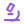
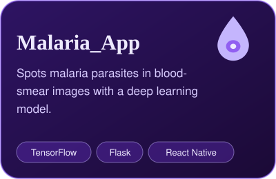
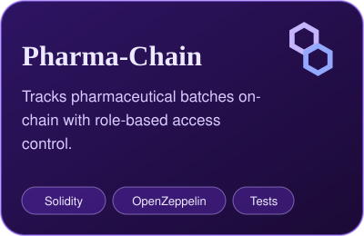
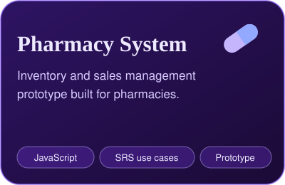
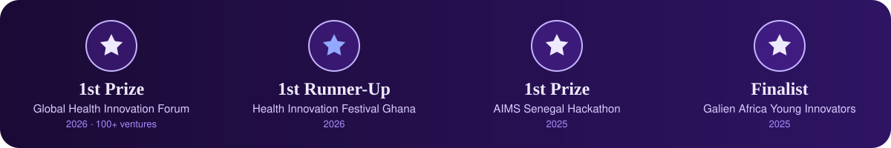

  

I build AI tools that bring diagnosis closer to patients in low-resource settings. At **Mosaan Health** we're making a portable digital microscope that runs its AI fully offline, and I'm now moving deeper into **bioinformatics and precision medicine**.

 Looking for a 6-month internship in AI for health or bioinformatics, starting January 2027.

###  What I work on

- **Edge AI for diagnostics:** offline TensorFlow Lite models on Raspberry Pi 5 for malaria and cervical pathology samples
- **Health data and ML:** clinical data analysis and predictive modeling with scikit-learn
- **Health software:** mobile health apps, pharmacy systems and drug supply-chain traceability

###  Featured work

  
  
  

###  Toolkit

  
  
  
  
  
   
  
  
  
  
   
  
  
  

###  Recognition with Mosaan Health

  
  

  

I build AI tools that bring diagnosis closer to patients in low-resource settings. At **Mosaan Health** we're making a portable digital microscope that runs its AI fully offline, and I'm now moving deeper into **bioinformatics and precision medicine**.

🔭 Looking for a 6-month internship in AI for health or bioinformatics, starting January 2027.

### 🔬 What I work on

- **Edge AI for diagnostics:** offline TensorFlow Lite models on Raspberry Pi 5 for malaria and cervical pathology samples
- **Health data and ML:** clinical data analysis and predictive modeling with scikit-learn
- **Health software:** mobile health apps, pharmacy systems and drug supply-chain traceability

### 💜 Featured work

  
  
  

### 🧪 Toolkit

  
  
  
  
  
   
  
  
  
  
   
  
  
  

### 🏆 Recognition with Mosaan Health

  
  

